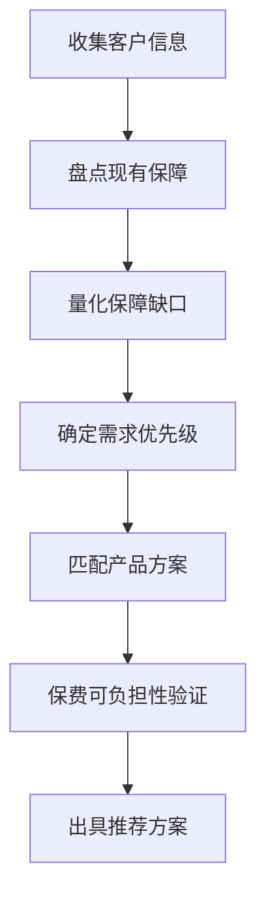

# FNA财务需求分析指南

> 基于香港保监局GL30指引及行业标准FNA框架整理
> ⚠️ 本文档为辅助分析工具，不构成任何投资建议或保险购买建议。实际投保应咨询持牌保险顾问。

---

## 一、FNA概述

**FNA（Financial Needs Analysis，财务需求分析）** 是香港保监局规定的人寿保险销售必经流程。自2016年1月1日起，所有香港保险公司在销售人寿保险产品前，必须对客户进行FNA评估，确保推荐的产品适合客户的实际需要和财务状况。

### 法律依据

- **GL30指引**：《财务需要分析指引》（Guideline on Financial Needs Analysis）
- **适用范围**：所有个人客户的人寿保险产品销售
- **核心原则**：适合性原则（Suitability Principle）——推荐的产品必须适合客户的财务状况和保障需求

---

## 二、FNA四大评估维度

### 维度1：个人与家庭信息

| 信息类别 | 具体字段 |
|---------|---------|
| 基本信息 | 姓名、年龄、性别、国籍、职业、雇主 |
| 家庭结构 | 婚姻状况、配偶年龄/职业、子女数量/年龄、父母状况 |
| 居住信息 | 居住城市、是否持有香港身份证 |
| 健康状况 | 吸烟/非吸烟、已知疾病、家族病史 |

### 维度2：财务状况分析

#### 资产负债表

| 资产项目 | 金额 | 负债项目 | 金额 |
|---------|------|---------|------|
| 现金及存款 | $______ | 房贷余额 | $______ |
| 股票/基金/债券 | $______ | 车贷余额 | $______ |
| 投资性房产 | $______ | 信用卡负债 | $______ |
| 已有保险现金价值 | $______ | 其他负债 | $______ |
| 其他资产 | $______ |  |  |
| **总资产** | **$______** | **总负债** | **$______** |
| | | **净资产** | **$______** |

#### 收入支出表

| 收入项目 | 年金额 | 支出项目 | 年金额 |
|---------|--------|---------|--------|
| 本人税后收入 | $______ | 家庭日常开支 | $______ |
| 配偶税后收入 | $______ | 房贷/租金 | $______ |
| 投资收益/租金 | $______ | 子女教育费用 | $______ |
| 其他收入 | $______ | 保险保费支出 | $______ |
|  |  | 其他支出 | $______ |
| **总收入** | **$______** | **总支出** | **$______** |
| | | **年结余** | **$______** |

### 维度3：现有保障盘点

#### 3.1 保障概况

| 保障类型 | 已有保单 | 保额 | 年保费 | 保障期限 |
|---------|---------|------|--------|---------|
| 人寿保障 | ______ | $______ | $______ | ______ |
| 危疾保障 | ______ | $______ | $______ | ______ |
| 医疗保障 | ______ | $______ | $______ | ______ |
| 意外保障 | ______ | $______ | $______ | ______ |
| 退休/储蓄 | ______ | $______ | $______ | ______ |
| 年金计划 | ______ | $______ | $______ | ______ |

#### 3.2 已有保单明细（逐条录入）

| 序号 | 产品名称 | 保险类型 | 保额(HKD) | 年缴保费(HKD) |
|------|---------|---------|----------|-------------|
| 1 | ______ | 储蓄分红/危疾/医疗/VHIS/寿险/意外/年金/其他 | $______ | $______ |
| 2 | ______ | ______ | $______ | $______ |
| ... | ... | ... | ... | ... |
| **合计** | | **___份** | **$______** | **$______** |

> 💡 逐条录入每份已有保单，有助于精准分析保障缺口。保险代理人应引导客户完整填写所有在供保单。

### 维度4：保障需求量化

#### 4.1 寿险保障缺口

**需求法（推荐）**：

```
寿险需求 = 遗属生活费总额 + 子女教育金 + 负债总额 + 身故费用 - 已有保障 - 可变现资产
```

| 项目 | 金额 |
|------|------|
| 遗属生活费（年支出×期望年数） | $______ |
| 子女教育金 | $______ |
| 房贷/负债总额 | $______ |
| 身故费用（丧葬等） | $______ |
| 已有人寿保障 | -$______ |
| 可变现资产 | -$______ |
| **寿险缺口** | **$______** |

**生命价值法**：

```
寿险需求 = （本人年收入 - 本人年个人支出）× 距退休年数
```

#### 4.2 危疾保障缺口

```
危疾保额需求 = 治疗费用（3-5年）+ 收入补偿（3-5年年收入）+ 康复费用 - 已有危疾保障
```

| 参考标准 | 金额 |
|---------|------|
| 香港癌症平均治疗费 | HKD 50-150万 |
| 3年收入补偿（月入3万为例） | HKD 108万 |
| 建议最低保额 | **年收入的3-5倍** |

#### 4.3 医疗保障缺口

| 问题 | 评估 |
|------|------|
| 是否有公司团险？ | 是/否 |
| 团险保障是否充分？ | 是/否 |
| 是否需要全球保障？ | 是/否 |
| 垫底费偏好？ | $0 / $2万 / $5万 |
| 推荐方向 | 团险充足→VHIS补充；团险不足→高端医疗 |

#### 4.4 退休/储蓄保障缺口

```
退休缺口 = 期望退休生活年支出 × 退休后年数 × 通胀系数 - 现有储蓄/投资 - 已有年金
```

| 参考标准 | 数值 |
|---------|------|
| 香港退休平均月支出 | HKD 2-4万 |
| 退休后年数 | 20-30年 |
| 年通胀假设 | 3% |
| 港险储蓄险长期IRR | 5.5%-6.5%（100%实现率） |

---

## 三、FNA分析流程



### Step 1: 收集信息
- 使用维度1-2的表格收集客户个人、家庭和财务信息
- 重点确认：年龄、收入、负债、家庭责任

### Step 2: 盘点现有保障
- 使用维度3的表格梳理已有保险
- 注意：社保/医保不在计算范围内（内地社保保障有限）

### Step 3: 量化保障缺口
- 使用维度4的公式计算各类型保障缺口
- 缺口为正数 → 有保障需求
- 缺口为负数 → 该类型保障已充分

### Step 4: 确定需求优先级

| 优先级 | 保障类型 | 判断标准 |
|--------|---------|---------|
| **P0 最紧急** | 医疗保障 | 无任何医疗保障，或仅有社保 |
| **P1 紧急** | 危疾保障 | 家庭唯一经济支柱，无重疾保障 |
| **P2 重要** | 寿险保障 | 有房贷/车贷，或未成年子女 |
| **P3 中期** | 储蓄/退休 | 保障类已充分，有闲置资金 |
| **P4 长期** | 传承/年金 | 高净值客户，有财富传承需求 |

### Step 5: 匹配产品方案
- 根据需求优先级和保费预算，从技能参考文件中匹配产品
- 保障类产品参考 `health-critical-illness.md`
- 储蓄类产品参考 `product-comparison.md`
- 保费预算参考 `premium-calculator.md`
- 优惠信息参考 `promotions.md`

### Step 6: 保费可负担性验证

```
年保费 ≤ 年结余的 10%-20%（保障类）
年保费 ≤ 年结余的 30%-40%（含储蓄类）
```

⚠️ 超过此比例需特别提醒客户，并在FNA表格中标注

---

## 四、常见客户画像与推荐方案

### 画像1：内地中产家庭（30-40岁）

| 维度 | 典型情况 |
|------|---------|
| 家庭收入 | 年收入30-60万人民币 |
| 主要担忧 | 健康风险 + 资产贬值 |
| 保障缺口 | 重疾保障不足、无全球医疗 |
| 推荐方案 | VHIS/高端医疗 + 危疾险（50-100万）+ 储蓄险（5年缴） |
| 年保费预算 | 5-15万港币 |

### 画像2：高净值企业家（40-55岁）

| 维度 | 典型情况 |
|------|---------|
| 家庭收入 | 年收入200万+人民币 |
| 主要担忧 | 财富传承 + 税务规划 + 人民币贬值 |
| 保障缺口 | 传承方案缺失、资产单一 |
| 推荐方案 | 大额储蓄险（传承型）+ 高端医疗（全球保障）+ 危疾险 |
| 年保费预算 | 30-100万港币 |

### 画像3：年轻专业人士（25-30岁）

| 维度 | 典型情况 |
|------|---------|
| 家庭收入 | 年收入15-25万人民币 |
| 主要担忧 | 健康风险 + 强制储蓄 |
| 保障缺口 | 几乎无商业保险 |
| 推荐方案 | VHIS自愿医保 + 储蓄险（10年缴）+ 定期寿险 |
| 年保费预算 | 2-5万港币 |

### 画像4：退休规划族（50-60岁）

| 维度 | 典型情况 |
|------|---------|
| 家庭收入 | 年收入20-40万人民币 |
| 主要担忧 | 养老金不足 + 医疗费用 |
| 保障缺口 | 退休后收入断裂、医疗费用攀升 |
| 推荐方案 | 高端医疗 + 年金险/延期年金 + 储蓄险（短期缴） |
| 年保费预算 | 10-25万港币 |

---

## 五、FNA填写注意事项

1. **必须如实填写**：香港保监局要求FNA信息真实准确，虚假信息可能导致保单失效
2. **签名确认**：客户必须亲自签署FNA表格，代理人和经纪人均不能代签
3. **保存期限**：FNA表格需保存至少7年
4. **更新义务**：客户情况发生重大变化时，建议重新进行FNA评估
5. **隐私保护**：所有个人财务信息受香港《个人资料（私隐）条例》保护

---

## 六、FNA与投保流程的关系

```
客户咨询 → FNA分析 → 确认需求 → 产品推荐 → 申请投保 → 核保 → 保单签发
```

- FNA是**投保前**的必经步骤
- 保险公司会审核FNA的合理性
- 若FNA显示客户无法负担保费，保险公司有权拒绝承保
- FNA结果会影响产品的适合性判断

---

> ⚠️ **免责声明**：本文档仅提供FNA分析框架和方法论参考，不构成任何保险购买建议。实际投保应咨询香港持牌保险顾问，并由其出具正式的FNA分析报告。
